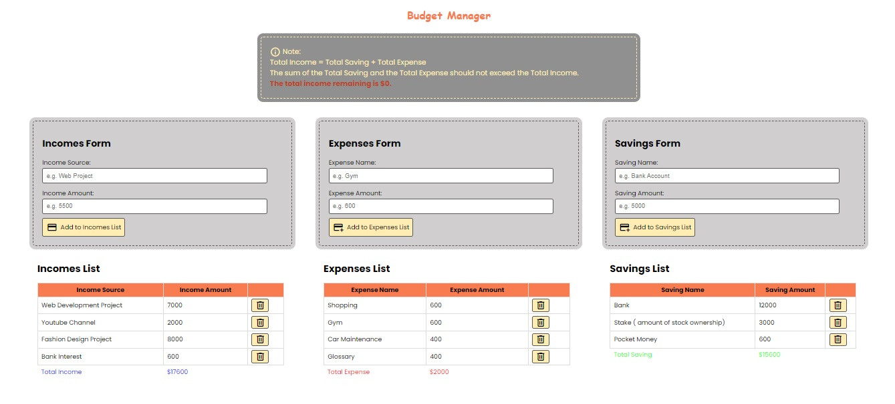
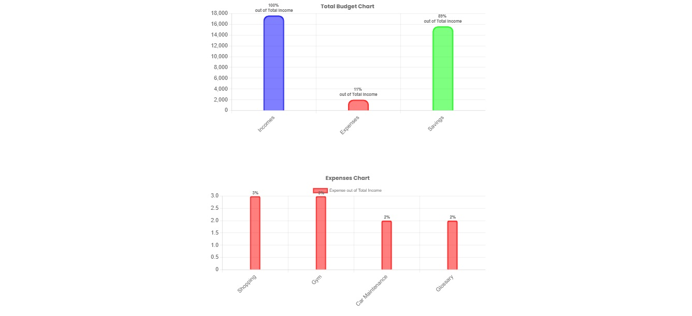

# ReactJS-Budget-Manager (<font size='3'> V1 </font>)

#### By _**Mahashi-github**_

#### This is a single-page ReactJS & JSON-Server budget-manager application. This application provides incomes, expenses and savings add-item forms and presents tables of those data. The limitation of 'Total Income = Total Saving + Total Expense' is applied into the total sums.Error handling for fetching data is also provided. For better analysis, two bar charts also present the data: 
* a total budget chart (showing the total income, expense and saving and their percentages out of the total income). 
* an expenses chart (presenting the percentage of each expense out of the total income). 

## Technologies Used
* _ReactJS_
* _React-router-dom (Outlet, useLoaderData, errorElement, Form, useFetcher, action, NavLink)_
* _React-Hooks (useContext, useEffect, useState, useRef)_
* _css_
* _jsx_
* _JSON-server_
* _chart.js_
* _react-chartjs-2_
* _chartjs-plugin-datalabels_

## Setup
This react app is created by 'npm create vite@latest directoryName'. 

To run this project, install it locally:

First terminal:
```
$ npm install
$ npm run dev
```
Second terminal:
```
$ npx json-server -w data/db.json -p 8000
```

## Screenshots of the Application
<p>
  
  
</p>